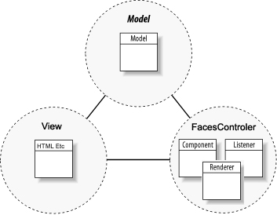
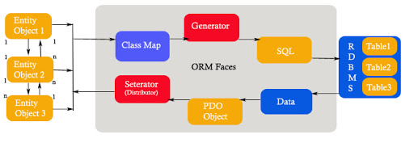

PHP Faces MCV based rapid application development framework.

This project, an application framework similar to the (Java Server Face) JSF and ASP.NET

Event-oriented programming with a brief MVC pattern combines

PHP ORM faces persistence library

**Features**

MVC (Model-View-Controller)

Component architecture

UI components

Event-oriented programming

AJAX

Template Engine

Custom Tags

ORM Entity Framework(Object Relation Mapping)

Validations

Pagination

URL Rewriting

